# Dreambooth Ion Cannon

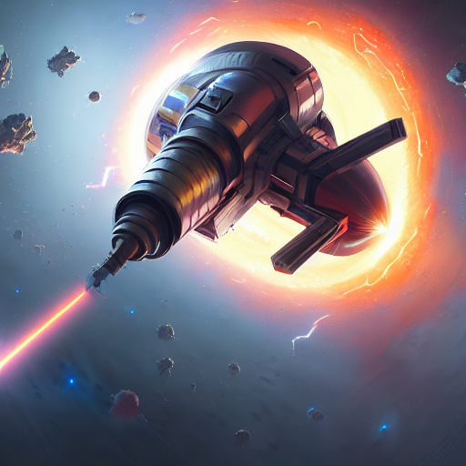

## Purpose

The Dreambooth Ion Cannon is a repository that abstracts away a large chunk of the execution pain points of [The Repo Formerly Known As Dreambooth](https://github.com/JoePenna/Dreambooth-Stable-Diffusion), providing a layperson an easily accessible guide to uploading images, training a Stable Diffusion model on said images, and generating new images according to pre-selected prompts.

This repo (and _particularly_ this `README`) should be considered under active development until such time as this line of text disappears, so please pop in every so often in case things still appear piecemeal. I will be adding new prompts on occasion to the model (and have several ideas on how to smooth the path to training multi-subject models), so be aware that this is very much a construction zone.

After finishing the guide (again, active work if you're reading this line), I'll add some points on how to search for prompts and run them yourself using this repository - if you already know how to hunt them down, or have any that you've been using yourself and are particularly impressed with, [tag me on Twitter](https://twitter.com/functi0nZer0) with a screenshot as well as the prompt text and the seed, and I'll consider them for inclusion!

## Disclaimer

I must reiterate here - the _vast_ majority of this code is not my work.

This repository is a fork of a fork of a fork, with the original by [Xavier Xiao](https://github.com/XavierXiao) found [here](https://github.com/XavierXiao/Dreambooth-Stable-Diffusion), the work of [Joe Penna](https://github.com/JoePenna) et al found [here](https://github.com/JoePenna/Dreambooth-Stable-Diffusion), and the work of [Kane Wallmann](https://github.com/KaneWallmann) found [here](https://github.com/KaneWallmann/Dreambooth-Stable-Diffusion).

In the interests of simplicity, I have removed all text in this README that is not directly related to how to use this repository. If you have issues with image quality etc, please read through Kane's repository (as it contains notes from all other parties involved). There is a lot of wonderfully insightful stuff in there.

I am focusing the below 'how-to' on [Vast.AI](https://vast.ai) as the provisioning platform for GPU compute, simply because when I was trying this out, that was the platform that had resources available. Joe has asked folk to utilise RunPod [with his referral link](https://runpod.io/?ref=n8yfwyum), which allows him to continue his work without paying for it - if you're more technically inclined and feel confident that you can run a Jupyter notebook with Pytorch in a platform-agnostic manner, I strongly recommend you do so in order to show support.

## Controlling The Ion Cannon

This section is currently being sanity-tested by early-comers. If you're confused, come back in a bit - if you're still confused after that, ping me on Twitter and let me know what part you're struggling with!

Some of this will seem almost patronising in tone: I wrote this first pass in a rush after getting hit with a block-wide powercut, and I'm trying to account for all questions I might get in advance, so apologies in advance if necessary!

### Step 0

You're going to want to sign up to [Vast.AI](https://vast.ai), log in, and add a payment method.

I'm not going to hand-hold you through how to do that, as it's a website with a sophisticated UX, and it uses Stripe and Crypto.com as its payment rails. I've been following Joe's advice and adding credit in US$10 increments - that will be more than enough for you to start.

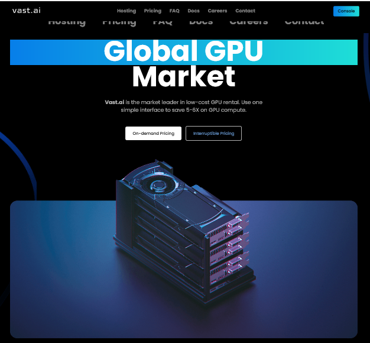

### Step 1

Once you're logged in and have some credit available, go to the `Create` section of the Console.

Here, you'll want to make sure that the image (pre-installed software on a new instance you create) has Pytorch available on it. 

Click on `Edit Image & Config...`, highlighted below. Note that I've edited the required disk space to be 150 GB - this is _far_ in excess of what you'll need, but space costs mere pennies. Stick with about 50 GB if you're not a spendthrift, that'll do fine.
 
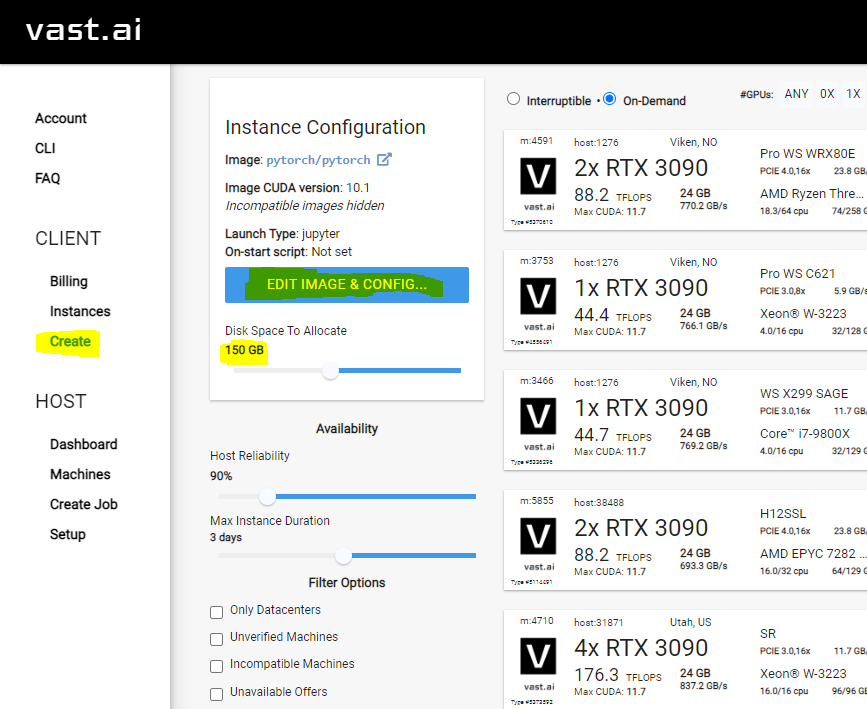

### Step 2

Ensure that you've selected `Pytorch`. The 'what it is' is ably explained in the below screenshot: it's a deep-learning framework. You need it.

Previous iterations of this repository have suggested checking the Jupyter lab interface and direct HTTPS options, but to be honest, when I was setting all of this up, I forgot to do it, and it's simple enough to work through without it (this advice may change when I finally get around to trying it out).

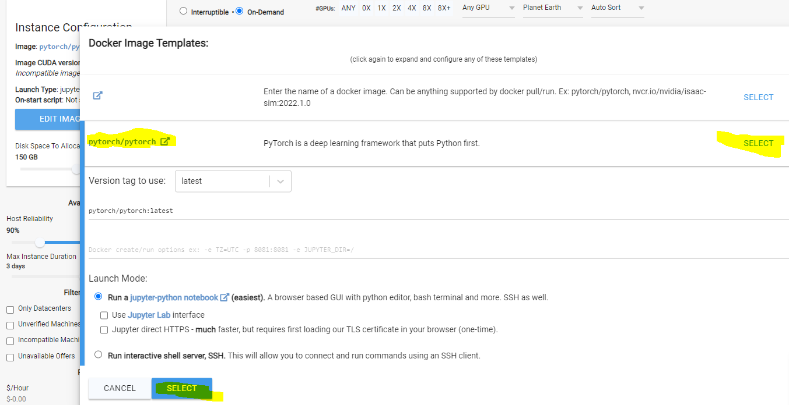

### Step 3

Now you need to rent out some hardware to actually run things on.

I tend to select `Only Datacenters` as a filter because the instances that are available there are _very_ fast to spin up - in the range of seconds - and have solid bandwidth: the price per hour reflects this, even though it only amounts to a couple of cents per hour. You're free to not do this, of course, but note that if you don't you might find your instance taking a very long time to get started.

One **critical** choice you need to make is that whatever you rent _must_ have 24 GB VRAM (highlighted below). Beyond that, you're free to select whichever one is cheapest: this will work on even a single card (i.e. you might as well aim for whichever one is cheapest, I've not looked too hard into adding any fancy parallelisation stuff yet).

When you've found the one you want, hit `Rent`. You'll get a little popup informing you as much.

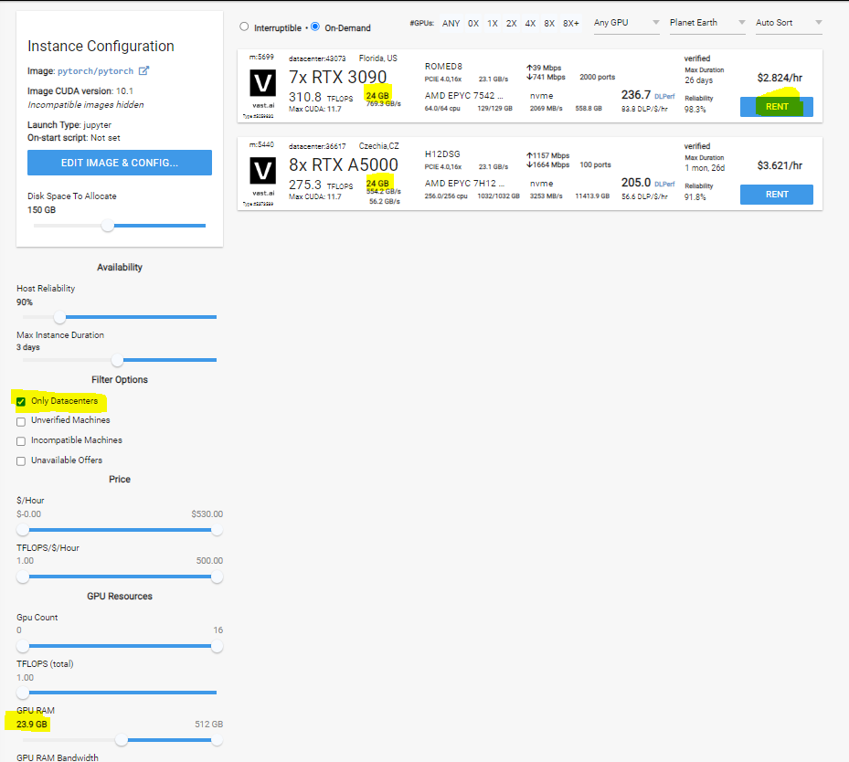

### Step 4

Head now to the `Instances` section of the Console (again, it's on your left).

Given that you've just rented this, it'll need a minute to wake up, load Pytorch and become available for you to `Open`. It shouldn't take too long.

Note: if, when you hit `Open`, it gives you a _502 Bad Gateway_, just wait another 30 seconds or so and try again - that just means your instance jumped the gun a bit. 

### IMPORTANT NOTE

#### When you are finished with this guide and seen your results, make sure you hit the Stop button for your running instance (the black square above Open)!

#### If you don't, the rest of your credit will needlessly drain away over time.

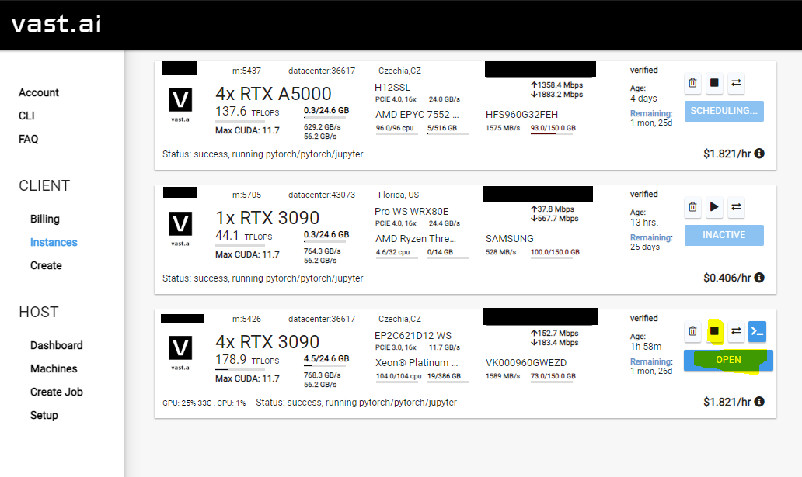

### Step 5

Right, you're in. Welcome to Jupyter.

First thing you're going to want to do is grab _this repo_ - the same one you're reading the README of right now. That involves doing a `git clone` of this repository, and to do that, you need to create a new Jupyter notebook so you can run a command.

Click `New` > `Python 3 (ipykernel)`.

A new tab is going to open. Don't close (or misplace) the tab you were just in - you'll be coming back!

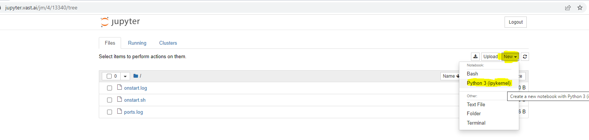

### Step 6 

Behold - a Jupyter notebook!

Copy and paste the following line into the only available cell - 

`!git clone https://github.com/laurenceday/Dreambooth-Ion-Cannon.git`

\- and then hit `Ctrl`+`Enter`. It's going to download 16 MB worth of files. This should be near instantaneous.

Once you see the line `Resolving deltas (n/n)` you're finished here (the screenshot below is out of date, but illustrative). Go back to the last tab you were in (the one you created this notebook from).

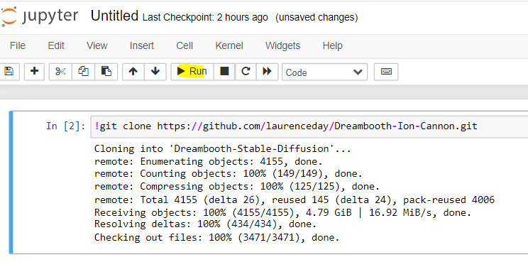

### Step 7

Easy one for you - click into the `Dreambooth-Ion-Cannon` directory.

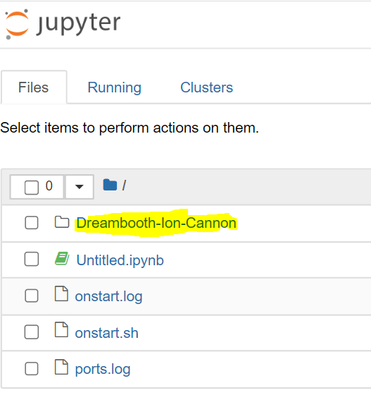

### Step 8

And then into the `training_samples` directory...

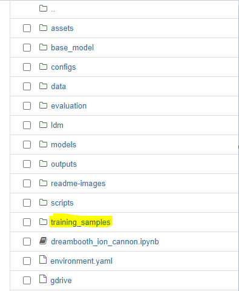

### Step 9

This is where you're going to put the photographs that constitute the training set for whoever you're trying to generate images for. 

Not _here_, exactly, but in a subdirectory with a name corresponding to whether your subject is a `man`, `woman`, `person`, `dog` or `cat` (this is up to you to decide, obviously - this has to do with regularisation, something you don't need to be overly concerned with unless you're particularly curious: refer to Kane's repository for more details).

Please also note the name of the file in this directory (and what it says): it's only in here so that the directory exists for you to get to this point. I'll probably tinker with the notebook to automatically delete this soon, but for the time being, pay it some mind.

Go ahead and click `New` > `Folder`, highlighted below.

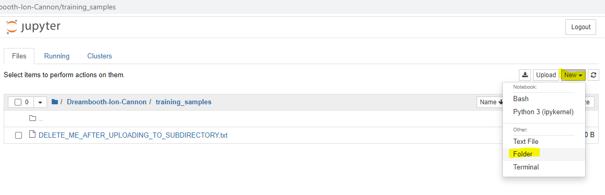

### Step 10
Select the checkbox option next to the newly created `Untitled Folder`, and hit `Rename`.

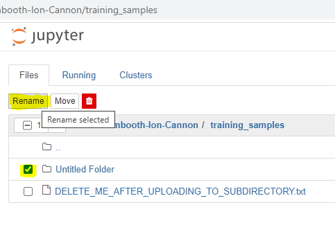

### Step 11

Depending on the class of the person you're trying to train, name the folder `man`, `woman` or `person`.

You're welcome to use another category if you want (so long as you're consistent in the notebook itself, as detailed in Step 17 below), but no regularisation will take place.

I'm wary about adding too many additional categories due to space bloat within the repository, but will probably add `dog` and `cat` soon enough for your pets.

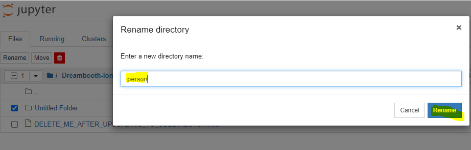

### Step 12

Enter the `{class}` directory that you've just created, and hit `Upload`.

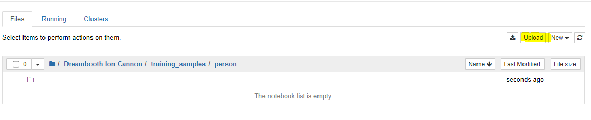

### Step 13

Here's the step that requires a couple of caveats.

In this folder, you'll want to upload between 8-10 `.png` files capturing someone's likeness.

There's conflicting advice about whether these should be a mix of full-body, selfies and medium-length shots, but I've personally found that just selfies work fine, provided that they've got different background lighting, clothes, facial expressions and so on.

Most of the prompts generated focus on portraits in any event, so the shape of the body is something of an irrelevance. 

As an example, I've chosen [@inversebrah](https://twitter.com/inversebrah) - partially to demonstrate that `person` can be used very liberally, and also that cartoon representations work fine provided that you have enough variation in your training set!

It is _very_ important that these images follow the format `{identifier} {class}_001.png`, `{identifier} {class}_002.png`, `{identifier} {class}_003.png` and so on: if you get this wrong your model is likely to train incorrectly (or fail to execute outright). If this happens, I'm claiming zero responsibility for wasted compute time.

See `inversebrah person_001.png` et al. I actually don't know yet if uploading `.PNG` files (upper-case) causes the model training to fail - I'll get around to checking that soon, but it takes you no time to rename them if so. If you have .jpg files, you can use a site such as [this](https://jpg2png.com/) to convert them.

Select all appropriate files from the upload file-system modal that pops up, and click OK. 

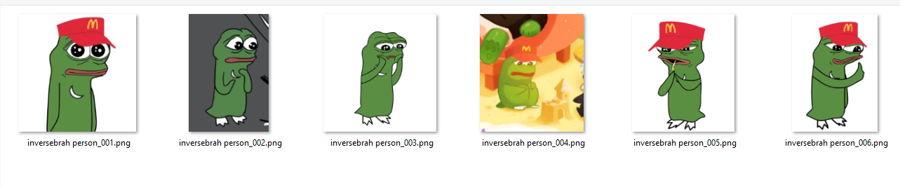

### Step 14

You're going to have to click `Upload` on every single image. Sorry!

There might be a delay in upload depending on the size of the underlying file, but you'll know you're done when each of the files has a time entry under Last Modified.

Once that's done, click on `training_samples` in the filepath above the images to navigate back to that directory.

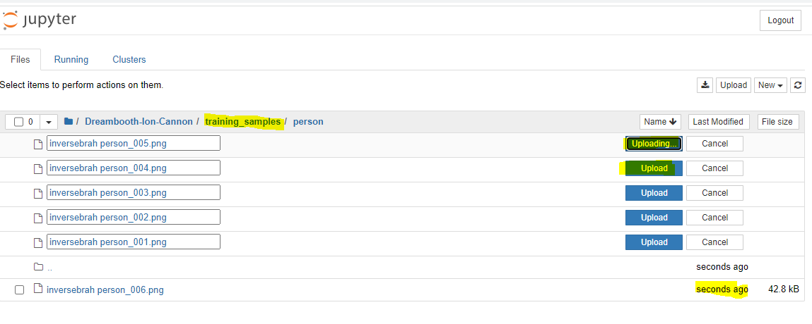

### Step 15

No, seriously, you have to delete that .txt file that says to do it (unless you deleted it straight away).

Select it, delete it.

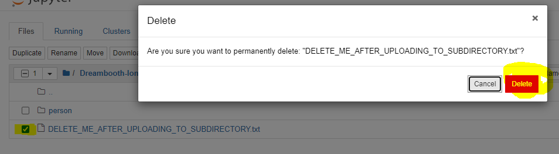

### Step 16

Once that's done, click on the `Dreambooth-Ion-Cannon` directory in the filepath to navigate back to that directory.

Now you're going to access the code that actually trains Stable Diffusion with the likeness of the subject and punts out images per prompts that I've found work well.

Click on `dreambooth_ion_cannon.ipynb`: a new tab will open.

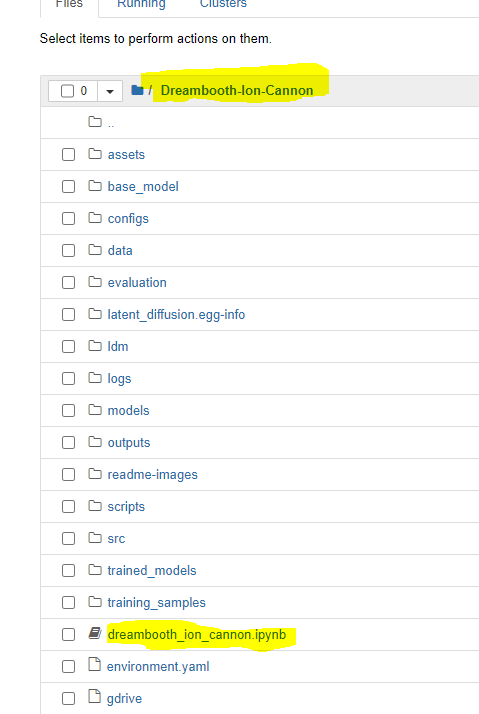

### Step 17

I've written a bit of text here that talks about - inter alia - who did the bulk of the work on this, how the naming scheme work for the training images again (just to drill it home), and some legal provisos. Underneath this text, there's a cell with two variables in it: `target_name` and `target_class`.

These are the *only* things you'll need to edit. **Based on what you named the images in your training set**, edit these values now.

There are some other parameters there, but they are set to default values (and are explained in the notebook above that cell), so you don't _need_ to change them if you don't want to. Go and have a read in the notebook if you're curious.

Now, select `Cell` > `Run All` from the menu bar above the notebook.

You can now... go away for a while. The Jupyter notebook is going to do a few things:

* Install all of the Python package dependencies needed,
* Fetch a copy of the Stable Diffusion v1.4 base model from a separate repo, then reconstruct it locally,
* Train the base model with the likeness of your target using the token identifier specified in the images,
* Prune the resulting model checkpoint from ~12 GB to ~2 GB,
* Move the pruned model into the `/trained_models` subdirectory, and
* Start generating images for each of several distinct prompts

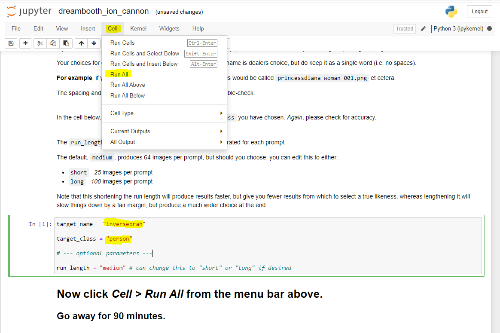

### Step 18

Whether you've come back after a few cups of coffee or sat watching nervously, the results are placed into the `/outputs` directory in various subdirectories.

These subdirectories will be named as `{target_name}_{keyword}`, where `keyword` is simply some identifier for the prompt, rather than the prompt itself, which often take a form something akin to -

` --prompt "Up close portrait of a beautiful {target_token} in black and white, photorealistic, upper body, art by diego fazio and diegokoi and artgerm, concept art, hyper sharp focus, 8k highly detailed"`

\- which is very cool and very legible.

Click one to enter whenever it gets generated - you aren't going to break anything by entering it as soon as it gets created.

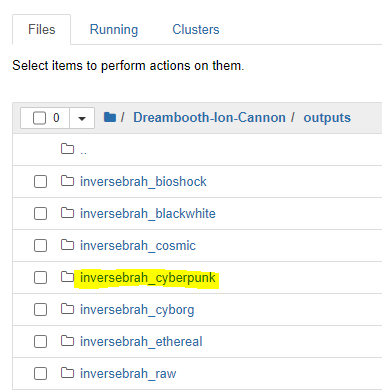

### Step 19

If you sit in one of these directories and watch while the prompt is being processed, you'll notice that periodically new images are added to the `/samples` directory.

When the prompt is completed, higher resolution images are all added to the `{target_name}_{keyword}` parent directory at once.

For the sake of easily viewing them all, a collage image is also generated, which takes the form `{target_name}_{keyword}-0000.jpg`.

You'll want to click on these.

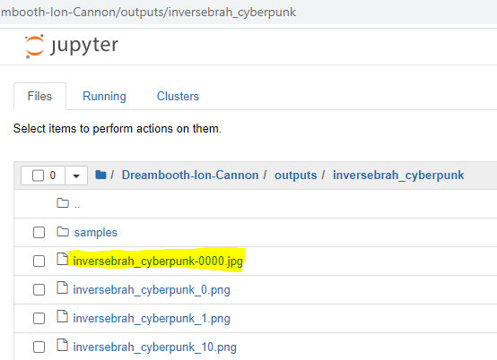

#### Step 20

"We knew the world would not be the same. A few people laughed, a few people cried. Most people were silent."

### Alert

**Please** make sure that you **stop** your instance once you've finished (see Step 4 above): if you don't, you're going to come back to this in a few hours days wanting to try it on someone else, only to find that all of the credit that you purchased has dwindled away.

It is best practice - both financially and for the purposes of minimising the time that images of people spend on third-party disk drives - to save the collages you like as you open them (I'll work on a process for pulling all of these out to a single location for you to download), and then **delete the instance** (the button to the left of the Stop square).

---

# Notes

This repo is pretty much brand-new, and the process is untested so far beyond my own tinkering with it.

I welcome folk - especially those who wouldn't call themselves 'technical' - to have a go and report back with any difficulties. I can't make this easier for people unless I know what people are stumbling on.

# Alpha

There are a couple of things I'll be adding in here over time - how you can help me add new filters, some things I'm going to extend this with, and so on -, but first I want to see how well this gets used. Please, if you're not anonymous and comfortable with people seeing the results (whether they be great or absolutely atrocious), let me know on [Twitter](https://twitter.com/functi0nZer0)!

# Thanks

My sincere thanks to [@Bonecondor](https://twitter.com/Bonecondor) for helping me find the prompts that inspired creating this, and [@KaneWallmann](https://twitter.com/KaneWallmann) for letting me know about this in the first place and absolutely destroying at least a week of my productivity.
